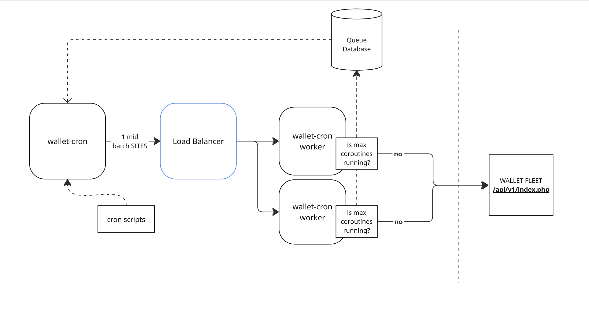

# Swoole High Concurrency App (vanilla Swoole)

Massively concurrent cURL using Swoole coroutines with throttling (global/per-host), plus a simple dispatcher.



## Environment
See `/environment/` for how to set up and download packages for full environment.

# Installation
## Docker
Start the PHP environment with Docker:
```bash
make build
```

# Errors? 

```shell
Fatal error: Uncaught MeekroDBException: SQLSTATE[HY000] [2002] No such file or directory in /var/app/current/vendor/sergeytsalkov/meekrodb/db.class.php:212
```

# Dev Ops
# Requirements
